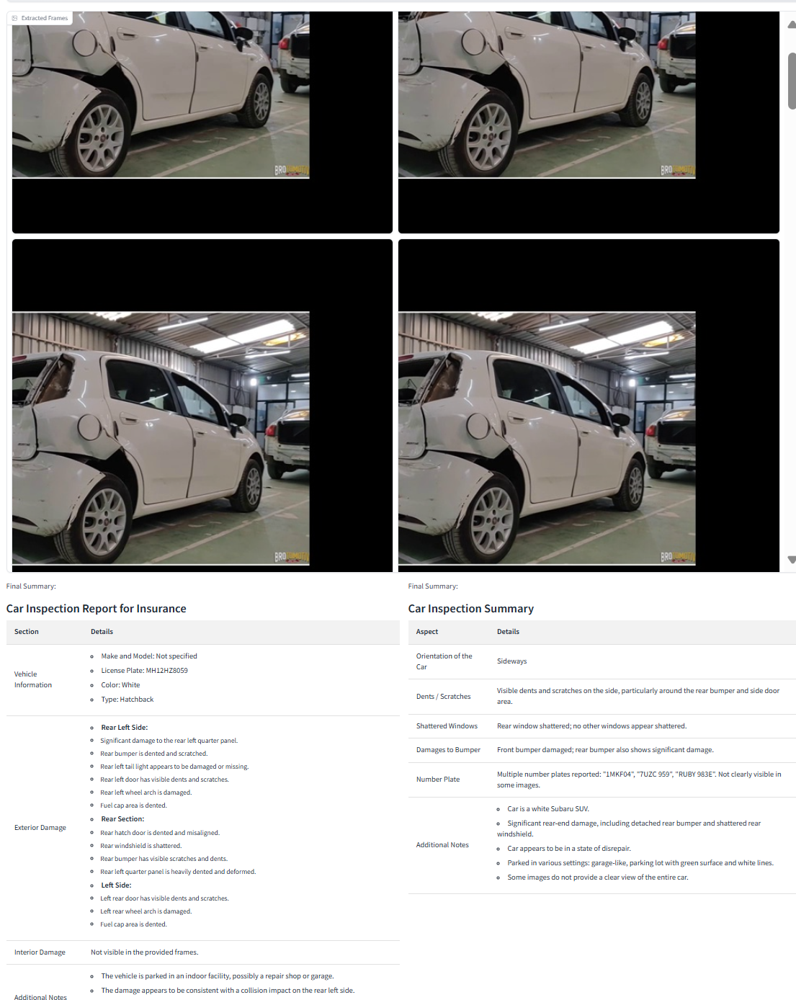

# insurance_claim_damage_assessment
---
- page_type: sample
- languages: python
- products: azure-openai, phi-3.5
- description: Sample Application for Video Analytics using Azure OpenAI
---

# Video Analytics Assistant


## Description

This repository contains a Jupyter Notebook file for the Video Analytics Assistant. The application processes videos to extract frames and audio, analyzes these frames for specific details (such as car inspection), and generates detailed summaries using Azure OpenAI models. It also utilizes "phi3" for advanced inspection tasks.

### Key Features:
- Extract frames from videos at specified intervals.
- Perform image analysis to detect and describe specific features, such as car orientation, visible damage, and other inspection details.
- Generate HTML-based summaries for easy comprehension and reporting.
- Utilize "phi3" for enhanced processing of frame data.
- Use Azure OpenAI API for generating content and responses based on analyzed data.

## Tools and Libraries

- **OpenCV**: For video and image processing.
- **MoviePy**: For audio extraction from videos.
- **Azure OpenAI**: For natural language processing and generating responses.
- **Gradio**: For creating an interactive frontend interface.
- **Pickle**: For saving and loading processed data.
- **dotenv**: For managing environment variables.
- **phi3**: Custom logic or library for advanced image and video frame analysis.

## Installation

1. **Clone the repository:**
    ```bash
    git clone <repository_url>
    ```
2. **Navigate to the directory containing the notebook:**
    ```bash
    cd <repository_name>
    ```
3. **Install the necessary dependencies:**
    ```bash
    pip install -r requirements.txt
    ```
4. **Set up environment variables:**
    Create a `.env` file in the same directory and specify values for the following variables:
    ```plaintext
    OPEN_AI_ENDPOINT=<your_open_ai_endpoint>
    OPEN_AI_KEY=<your_open_ai_key>
    MODEL_EP=<your_model_endpoint>
    MODEL_KEY=<your_model_key>
    ```

## Usage

1. **Open the Jupyter Notebook:**
    - Start Jupyter Notebook in the project directory:
      ```bash
      jupyter notebook
      ```
    - Open `VideoAnalytics.ipynb` from the Jupyter interface.

2. **Run the Notebook:**
    - Follow the instructions provided in the notebook to upload and process video files.
    - The notebook will guide you through extracting frames, analyzing images, and generating HTML summaries.

3. **Using Gradio Interface:**
    - Once you run the notebook, it will launch a Gradio interface that you can access in your web browser. This interface includes two primary buttons:
        - **Upload Video**: Use this button to upload the video file that you want to analyze.
        - **Process**: Clicking this button will extract frames from the uploaded video at specific intervals. These frames are essential for subsequent analysis.
        - **Summarize**: After frames are extracted, click this button to analyze the frames. This analysis is performed using both GPT-4o and phi3 models. It generates a detailed summary, including insights into car orientation, visible damages, shattered windows, number plate information, etc.

4. **Accessing the Gradio Interface:**
    - When you launch the notebook, it will provide a URL (e.g., `http://localhost:7860`). Open this URL in your browser to interact with the Gradio interface.

### Example Workflow:
- Upload a video file through the Gradio interface.
- Click the "Process" button to extract frames and audio from the video.
- Click the "Summarize" button to generate HTML summaries of the frame analysis.

### Example Outputs:
- Details about car orientation, visible damages, shattered windows, number plate information, etc.
- Consolidated HTML-based reports providing a detailed inspection overview.

## What's New

- **Multimodal Innovations**: The application supports multimodal processing, allowing analysis of both video and images.
- **Azure OpenAI Integration**: Leveraging GPT-4o for detailed and contextually accurate summaries.
- **phi3 Integration**: Advanced analysis using the phi3 framework for more nuanced and detailed video frame insights.

For more information, refer to the blogs:
- [Azure AI Blog](https://techcommunity.microsoft.com/t5/ai-azure-ai-services-blog/announcing-multimodal-innovations-in-generative-ai-with-azure/ba-p/4146804)
- [Phi-3 Blog](https://techcommunity.microsoft.com/t5/ai-azure-ai-services-blog/phi-3-vision-catalyzing-multimodal-innovation/ba-p/4170251)

---

